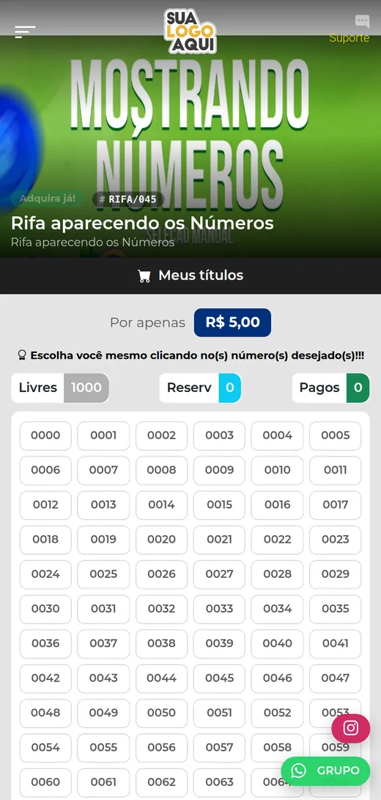
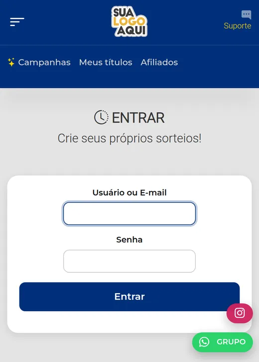
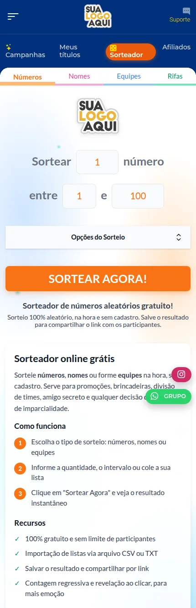

# Plataforma de Rifa — sistema de rifas e sorteios online em PHP/Laravel

Sistema web completo para **criar e administrar rifas, sorteios e ações entre amigos
pela internet**. O comprador escolhe quantas cotas quer, paga por **PIX** e recebe os
números no **WhatsApp**; o organizador acompanha as vendas e publica o ganhador — tudo
pelo painel, sem tocar em código.

Feito **mobile-first**: a tela de compra foi desenhada para o celular, de onde vem
praticamente todo o tráfego desse tipo de campanha.

**Demonstração ao vivo:** [rifa.alequizao.com](https://rifa.alequizao.com)


---

## Índice

- [Telas do sistema](#telas-do-sistema)
- [O que o sistema faz](#o-que-o-sistema-faz)
- [Como funciona uma rifa, na prática](#como-funciona-uma-rifa-na-prática)
- [Tecnologias](#tecnologias)
- [Instalação](#instalação)
- [Personalização visual](#personalização-visual)
- [WhatsApp por QR Code](#whatsapp-por-qr-code)
- [Perguntas frequentes](#perguntas-frequentes)
- [Documentação](#documentação)
- [Aviso legal](#aviso-legal)
- [Desenvolvedor](#desenvolvedor)

---

## Telas do sistema

| Página inicial com as campanhas | Tela de compra da campanha |
|:---:|:---:|
|  |  |

<details>
<summary><b>Ver as demais telas</b></summary>

<br>

| Escolha manual de números | Lista de campanhas ativas |
|:---:|:---:|
|  |  |

| Página de ganhadores | Acesso ao painel |
|:---:|:---:|
|  |  |

| Sorteador online (números, nomes e equipes) | Resultado do sorteio com link para compartilhar |
|:---:|:---:|
|  |  |

</details>

---

## O que o sistema faz

### Para quem compra

- **Compra rápida na página inicial**, com atalhos de quantidade e total calculado na hora
- **Modo automático** (o sistema sorteia os números) e **modo manual** (o comprador escolhe na grade)
- **Pagamento por PIX** com baixa automática — sem precisar enviar comprovante
- **Consulta dos próprios títulos pelo telefone**, sem criar conta nem senha
- **Página pública de ganhadores**, com foto, prêmio e data da premiação
- **Sorteador online grátis** (`/sorteador`), no estilo do sorteador.com.br: números, nomes (com lista por arquivo .txt/.csv e suplentes) e equipes, com contagem regressiva, revelação ao clicar e **link permanente do resultado** para compartilhar no WhatsApp

### Para quem organiza

- Painel com campanhas, vendas, ranking de compradores e relatórios
- **Aparência do site**: cores, tema claro/escuro, fonte e cantos, com prévia ao vivo
- **WhatsApp próprio via QR Code** — avisos de reserva, pagamento e prêmio saem do seu número, sem API paga
- **Pacotes promocionais** (+100, +200, +500…), com destaque para o mais vendido
- **Área de afiliados** com comissão por venda
- **Clientes**: cadastro manual, busca, edição, exclusão e exportação em CSV
- **Sorteio do ganhador da campanha** dentro do Sorteador: só cotas pagas, gerador criptográfico no servidor e código de conferência
- Manual ilustrado e histórico de versões dentro do próprio painel

---

## Como funciona uma rifa, na prática

1. O organizador cadastra a **campanha**: prêmio, foto, preço da cota e quantidade de números
2. O comprador escolhe **quantas cotas** quer (ou quais números, no modo manual)
3. As cotas ficam **reservadas** e o sistema gera o **PIX**
4. Pagou, o sistema **confirma sozinho**, marca as cotas como pagas e avisa no WhatsApp
5. Não pagou, a reserva **expira** e os números voltam a ficar disponíveis
6. No dia do sorteio, o organizador informa o **número sorteado** (normalmente pela Loteria Federal) e o ganhador é publicado

---

## Tecnologias

| Camada | O que usa |
|---|---|
| Back-end | PHP 7.4 · Laravel 5.8 |
| Banco de dados | MySQL |
| Front-end | Blade · Bootstrap 5 · CSS com design tokens · JavaScript sem framework |
| WhatsApp | Baileys (WhatsApp multi-dispositivos) via API HTTP |
| Pagamentos | Mercado Pago · Paggue · Asaas |
| Servidor | Apache ou Nginx |

Não há etapa de build no front-end: o deploy é enviar os arquivos e apontar o
servidor para `public/`.

---

## Instalação

```bash
git clone https://github.com/alequizao/plataforma-de-rifa.git
cd plataforma-de-rifa

composer install
cp .env.example .env
php artisan key:generate
```

Configure o `.env`:

```env
APP_URL=https://seudominio.com.br
DB_DATABASE=rifa
DB_USERNAME=usuario
DB_PASSWORD=senha

# WhatsApp (opcional)
WPP_API_URL=https://seu-painel/whatsapp/api
WPP_API_USER=usuario
WPP_API_PASS=senha
WPP_SESSAO=rifa
```

Importe o banco, aponte o DocumentRoot para `public/` e agende o cron, que libera
reservas vencidas e confirma os pagamentos:

```cron
* * * * * cd /caminho/do/projeto && php artisan schedule:run >> /dev/null 2>&1
```

> **Atenção:** use **PHP 7.4**. O Laravel 5.8 não roda em PHP 8.

---

## Personalização visual

Todo o tema vive em variáveis CSS num único arquivo (`public/css/tema-gemeos.css`).
A tela **Aparência do site**, no painel, grava as cores escolhidas no banco e o layout
as injeta na página — então trocar a identidade visual inteira do site não exige
editar CSS nenhum.

Dá para ajustar: cor primária, cor do botão de compra, fundo, cards, texto, barra,
cor de destaque, fonte e o arredondamento dos cantos, além de alternar entre
**tema claro e escuro**.

---

## WhatsApp por QR Code

Em vez de contratar uma API paga, o sistema conversa com uma sessão própria do
WhatsApp pareada por **QR Code** (protocolo Baileys, o mesmo do WhatsApp Web
multi-dispositivos). As mensagens saem do número do próprio organizador.

No painel: **Mensagens WhatsApp → Conectar / gerar QR**, escaneie com o celular e
pronto. A sessão fica salva e reconecta sozinha se o servidor reiniciar.

Detalhes de arquitetura, rotas e diagnóstico em [`WHATSAPP.md`](WHATSAPP.md).

---

## Perguntas frequentes

**Preciso pagar alguma API de WhatsApp?**
Não. A conexão é feita por QR Code com o seu próprio número, sem mensalidade.

**Dá para mudar as cores sem programar?**
Sim, pela tela Aparência do site, com prévia ao vivo e opção de tema escuro.

**Qual a diferença entre modo automático e manual?**
No automático o sistema sorteia os números do comprador; no manual ele escolhe na
grade. Campanhas grandes funcionam melhor no automático.

**Quantos números uma campanha suporta?**
Já roda campanhas de 1 milhão de números.

**Roda em PHP 8?**
Não sem adaptações — o Laravel 5.8 exige PHP 7.4.

Mais respostas em [`docs/FAQ.md`](docs/FAQ.md).

---

## Documentação

- [`WHATSAPP.md`](WHATSAPP.md) — integração Baileys: arquitetura, rotas, QR Code, envio programático e diagnóstico
- [`docs/ARQUITETURA.md`](docs/ARQUITETURA.md) — estrutura de pastas, modelo de dados e fluxos
- [`docs/FAQ.md`](docs/FAQ.md) — perguntas frequentes
- [`llms.txt`](llms.txt) — resumo estruturado do projeto para agentes de IA

---

## Aviso legal

Rifas e sorteios são atividades reguladas no Brasil. Quem opera a plataforma é
responsável por obter as autorizações necessárias, cumprir a legislação aplicável
e respeitar a restrição de idade. Este repositório entrega apenas o software.

---

## Desenvolvedor

Sistema desenvolvido sob medida por **Alequizao**.

- **E-mail:** alequizao.dev@gmail.com
- **WhatsApp:** [(82) 98871-7072](https://wa.me/5582988717072)
- **Instagram:** [@alequizao](https://instagram.com/alequizao)
- **GitHub:** [@alequizao](https://github.com/alequizao)

Quer um sistema como este para o seu negócio? Entre em contato.

---

© Alequizao · Código proprietário, disponível para leitura e avaliação.
Uso comercial, cópia ou redistribuição somente com autorização.
